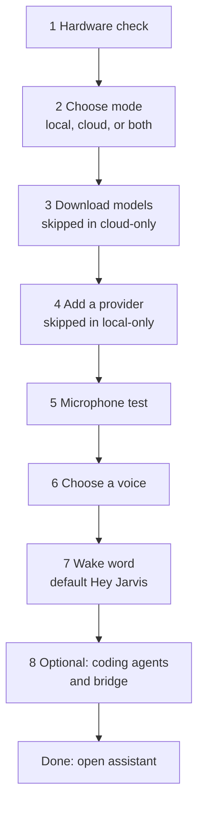
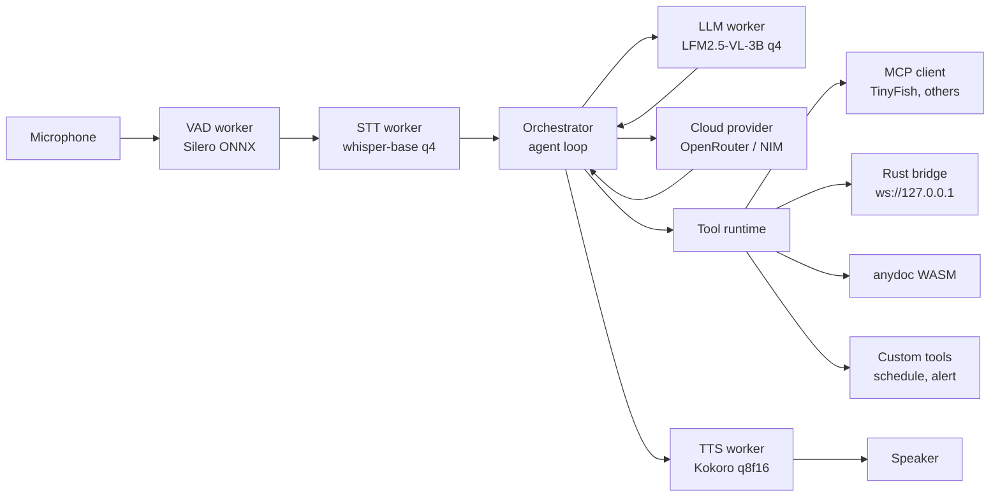
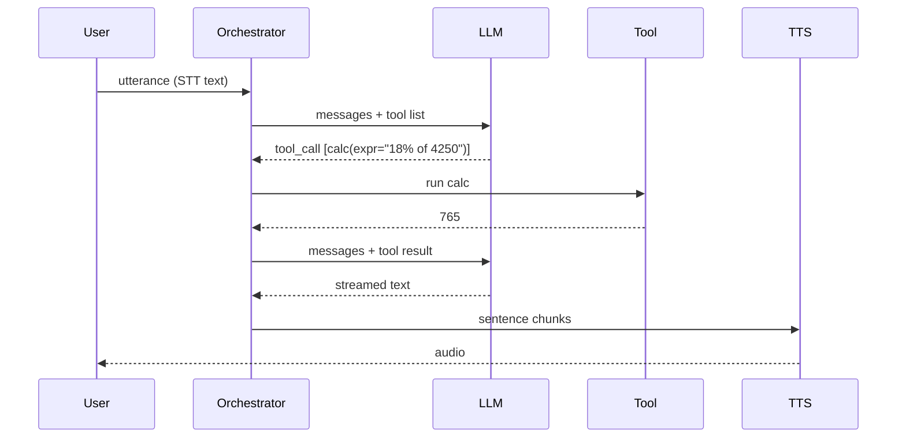
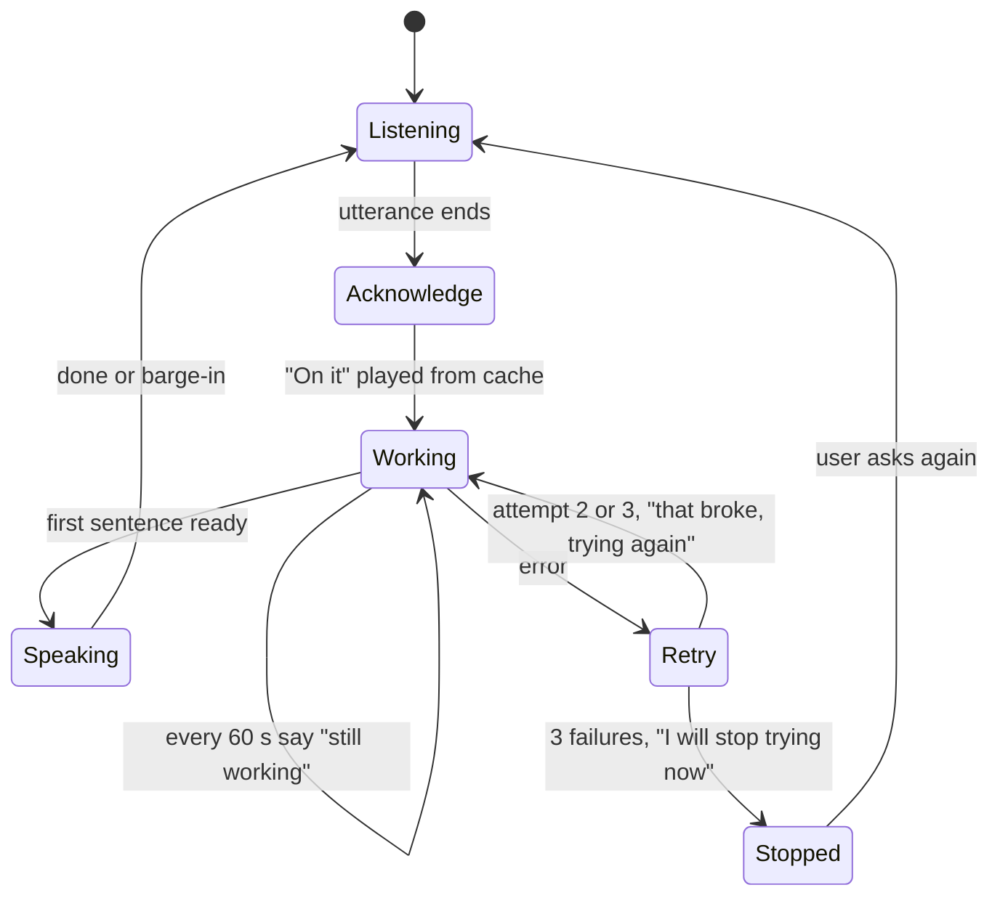
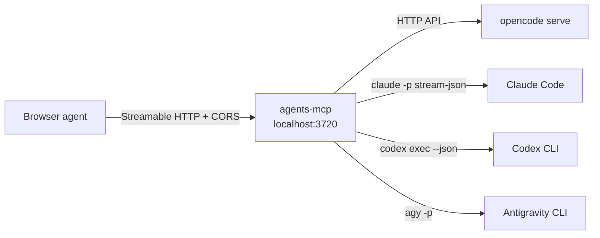
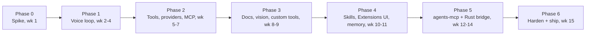

# Browser Voice Agent — BRD & Work Plan

2026-09-19 · Avinash Karanth

## Executive summary

Build a voice-first AI assistant that runs inside the browser: wake word, speech in, LLM reasoning, tool calls, speech out. The default reasoning model is local, downloaded once and executed on the user's GPU via WebGPU. First visit shows a landing page and a setup wizard; once configured, the app opens straight into the assistant. The user can switch a conversation to a cloud-hosted LLM when they want more capability; nothing leaves the machine otherwise, except tools the user explicitly marks remote such as web search.

The stack is fixed by the request: [transformers.js](https://github.com/huggingface/transformers.js) v4 as the runtime, [whisper-base](https://huggingface.co/onnx-community/whisper-base/) for speech-to-text, [LFM2.5-VL-3B](https://huggingface.co/LiquidAI/LFM2.5-VL-3B-ONNX) as the single local reasoning model for both text and images, and [Kokoro-82M](https://huggingface.co/onnx-community/Kokoro-82M-v1.0-ONNX) for text-to-speech. A provider picker offers ten hosted providers (OpenRouter and NVIDIA NIM first, then OpenAI, Anthropic, Gemini, Groq, Mistral, xAI, DeepSeek, Together), any custom OpenAI-compatible endpoint, and a local Ollama server. The agent calls tools natively, connects to MCP servers such as [TinyFish](https://docs.tinyfish.ai/mcp-integration) for search, fetch and browser automation, loads skills as markdown instruction packs installed from folders or from the SkillsMP and Context7 marketplaces, supports user-defined custom tools such as schedules and alerts, and extracts text from local files with [anydoc](https://github.com/firecrawl/anydoc) compiled to WASM. Everything the user adds is editable in an Extensions UI.

Coding agents (opencode, Claude Code, Codex, agy) are driven through per-agent skills and one local MCP server, `agents-mcp`, so voice can review code, work a ticket, and hear the result read back. A small Rust executable comes later for what MCP cannot do: open a terminal, launch apps, read files, take screenshots, send keystrokes, and proxy providers that lack CORS.

Total download for the local profile is about 2.7 GB (VL-3B about 2.5 GB q4 decoder plus fp16 vision encoder, whisper 143 MB q4, Kokoro 86 MB q8f16). Target first working voice loop in 4 weeks, full tool, MCP and cloud-provider support in 8, native bridge in 14.

## Goals, non-goals, principles

**Goals**

1. Full voice loop (wake word, listen, think, speak) running offline in Chrome or Edge after a one-time model download.
2. One local model, LFM2.5-VL-3B, handles text, tool calls and images; no model swapping.
3. Provider picker: ten hosted presets, custom OpenAI-compatible endpoints, and local Ollama; same tool registry everywhere; keys stored locally; cloud is also the full substitute when the device cannot run the local model.
4. Agent loop with native tool calling: calculator, clock, notes, file extraction, image understanding, browser automation, custom tools (schedules, alerts) and any MCP server the user adds.
5. Skills: drop-in markdown instruction packs, editable in the browser, installable from SkillsMP and other marketplaces.
6. Coding agents driven by skills plus the `agents-mcp` server: opencode, Claude Code, Codex, agy; their questions are read aloud and answered by voice.
7. Native bridge: a Rust executable for terminal, apps, files, screen and keystrokes.
8. Guided first run: landing page that explains how it works, then a wizard that sets up local or cloud models, microphone and wake word; returning users land in the assistant.
9. Everything inspectable and editable: transcript, tool calls, provider in use, skills, MCP servers, custom tools, memory and schedules all live in the UI; every remote call requires an explicit user opt-in.

**Non-goals (v1)**

- Silent cloud fallback. Cloud is a visible choice per conversation, never automatic.
- Paid cloud tiers in v1. Only free or user-paid keys; billing UI is out of scope.
- Mobile browsers as a supported target. Cloud-only mode may work there but is not tested in v1.
- Multi-user accounts, sync, or server-side storage.
- Training custom wake-word models inside the app. v1 ships prebuilt phrases; custom phrases are imported as model files.
- Full desktop computer-use (screen reading and mouse control). Bridge v1 is command-level: launch, type, read output.

**Principles**

- Local by default: models, documents, memory and transcripts stay in the browser's storage.
- Cloud by choice: the provider picker sits next to the microphone button and shows which model is answering; API keys never leave IndexedDB except in the request to that provider.
- Never silent: an acknowledgement within half a second, a status line every minute while working, and a spoken notice with automatic retry when something breaks, capped at three attempts.
- Interruptible: user speech cancels TTS and in-flight generation within 200 ms, local or cloud.
- One tool contract: local, MCP, custom, bridge and cloud-called tools all use the same registry and the same confirmation rules.
- Confirm before side effects: any tool marked destructive (delete, send, run shell, browser form submit) asks by voice and waits for a yes.
- Boring stack: transformers.js, Web Workers, Cache API, OpenAI-compatible fetch for cloud, one small Rust binary. No custom inference code.

## Users and use cases

Primary user is a developer or power user on a Windows, macOS or Linux laptop with a discrete or recent integrated GPU and 8 GB or more of RAM, who wants hands-free assistance without sending data to a cloud.

| # | User story | Phase |
| --- | --- | --- |
| U0 | Open the site for the first time, read how it works, and finish a wizard that leaves me with a working assistant in under 10 minutes on a good connection | 1 |
| U1 | Ask a question aloud and hear a spoken answer within 3 s of finishing the sentence | 1 |
| U2 | Say "what is 18 percent of 4,250" and get an exact calculator result | 2 |
| U3 | Say "search the web for the latest transformers.js release" and hear a summary with sources | 2 |
| U4 | Say "switch to cloud" and have the next answers come from a cloud vision model, with the provider shown on screen | 2 |
| U5 | Drop a PDF or DOCX on the page, then ask questions about its contents | 3 |
| U6 | Show the camera or a screenshot and ask "what is on this screen" | 3 |
| U7 | Say "go to the transformers.js docs, find the WebGPU section and read me the first paragraph" and have the agent browse the site and answer | 3 |
| U8 | Say "remind me at 4 pm to push the branch" and get a spoken alert at 4 pm, implemented as a custom tool | 3 |
| U9 | Say "use the code-review skill" and have the agent follow that skill's checklist | 4 |
| U10 | Say "remember that my staging URL is X" and have it recalled in later sessions | 4 |
| U11 | Say "open a terminal and run the tests" and hear the pass/fail summary | 5 |
| U12 | Say "ask opencode to complete ticket ENG-142"; when opencode asks "may I run npm install?" hear the question, answer "yes" by voice, and hear the final response | 5 |
| U13 | Work fully offline on a plane after models are cached, local provider only | 1 |
| U14 | With the tab open in the background, say the wake phrase and ask a question without touching the keyboard | 1 |

## Onboarding: landing page and setup wizard

First visit ends in a working assistant in under 10 minutes on a good connection. Returning visits skip everything.

**Where the app opens**

| State on load | What opens |
| --- | --- |
| `setup_complete` is false or missing | Landing page |
| `setup_complete` is true, chosen provider reachable (local models in cache, or cloud key saved and last test passed) | Assistant |
| `setup_complete` is true but provider not reachable (cache evicted, key revoked, Ollama down) | Assistant with a one-line banner: what is missing and a "Fix it" button that opens the wizard at that step |

**Landing page.** One scroll, no sign-in, no tracking. From top: one sentence on what it does; a 20-second muted demo loop; three cards (runs in your browser, your data stays local, works with your coding agents); a "how it works" strip showing the pipeline (wake word, speech to text, model, tools, speech out); a live hardware check panel (WebGPU yes or no, GPU memory, free storage, microphone present) with a plain-words verdict such as "This machine can run the local model" or "Use a cloud provider on this machine"; a short FAQ (download size, supported browsers, offline use, where keys are stored); one "Set up" button.

**Setup wizard.** Eight steps, one screen each, a progress bar on top, "why we ask" under every step. Each step saves as soon as it completes, so closing the tab resumes at the same step. Nothing in the wizard needs an account.



| Step | What the user sees | What is saved | Skippable |
| --- | --- | --- | --- |
| 1 Hardware check | Results for WebGPU, GPU memory, storage quota, microphone permission; a verdict and a recommended mode | hardware profile | No |
| 2 Choose mode | Three cards: Local (private, 2.7 GB download), Cloud (needs a key, no download), Both (local by default, cloud when asked). Card disabled with a reason if the hardware check failed | mode | No |
| 3 Download models | Total size before starting; per-file progress; pause, resume, retry; runs in the background while later steps continue | model cache, persistent storage granted | Only in cloud-only mode |
| 4 Add a provider | Preset list with OpenRouter and NVIDIA NIM first, custom endpoint form, Ollama auto-detect with copyable setup commands; key field; "Test connection"; default model picked automatically | provider, key, model | Only in local-only mode |
| 5 Microphone test | Level meter; record 3 seconds, play it back; pick the input device; the app transcribes the clip and shows the text so the user sees speech-to-text working | input device | No |
| 6 Choose a voice | Grid of Kokoro voices grouped by accent and gender; tap to hear the same sample sentence; speed slider; the chosen voice speaks "Hi, I am ready" | voice id, rate | No, but a default (`af_heart`) is preselected |
| 7 Wake word | Default phrase "Hey Jarvis" (openWakeWord prebuilt) preselected; other prebuilt phrases in a dropdown; "Import custom model" for a `.onnx` file; the user says the phrase three times and sees a confidence bar each time; a sensitivity slider; option "I will use push-to-talk instead" | wake phrase, sensitivity, mode | Yes, falls back to push-to-talk and hands-free VAD |
| 8 Coding agents and bridge | Detects agents-mcp on port 3720 and the bridge on 7711; shows the one command or download link for each with a copy button; explains the browser's Local Network Access prompt with a screenshot | agents URL, bridge pairing | Yes |
| Done | Summary card of every choice with an edit link per row; "Open assistant" | `setup_complete = true` |  |

After the wizard, the assistant greets the user in the chosen voice and, if wake word is on, says "Say Hey Jarvis whenever you need me." Every step is reachable later from Settings, and "Run setup again" restarts the wizard without deleting downloaded models.

| ID | Requirement | Pri |
| --- | --- | --- |
| ON-1 | Routing per the table above; reachability re-checked on every load | P0 |
| ON-2 | Landing page with live hardware check, demo, FAQ and one call to action | P0 |
| ON-3 | Step 1 hardware check with a plain-words verdict and recommended mode | P0 |
| ON-4 | Step 3 download queue with size preview, per-file progress, pause, resume, retry, background continuation | P0 |
| ON-5 | Step 4 provider setup with presets, custom endpoint, Ollama detection, test connection, automatic default model | P0 |
| ON-6 | Step 5 microphone test with playback and a live transcription of the clip | P0 |
| ON-7 | Step 6 voice selection with per-voice preview, speed slider, `af_heart` preselected | P0 |
| ON-8 | Step 7 wake word with "Hey Jarvis" default, three-utterance test, sensitivity, custom model import, push-to-talk opt-out | P0 |
| ON-9 | Step 8 detection of agents-mcp and bridge with copyable commands and the Local Network Access explanation | P1 |
| ON-10 | Wizard resumable at any step; summary card with per-row edit; "Run setup again" in Settings; text-only use never blocked once a provider works | P0 |

## System architecture

The browser app is a static single-page app (PWA) with three Web Workers, one per model, and a main-thread orchestrator. Audio never touches the main thread's render loop.



Speech flows left to right. The orchestrator owns the conversation state, decides when a model reply contains a tool call, runs the tool, appends the result with role `tool`, and loops until the model produces plain text, which is streamed sentence-by-sentence to the TTS worker.

**Layers**

- **Audio I/O**: `getUserMedia` at 16 kHz mono into an AudioWorklet ring buffer. VAD marks utterance boundaries. Playback via Web Audio API; barge-in stops playback and aborts generation.
- **Model workers**: STT, LLM and TTS each wrap one transformers.js model behind a `postMessage` protocol (`load`, `run`, `abort`, progress events). The LLM worker holds LFM2.5-VL-3B via `AutoModelForImageTextToText`; text-only turns pass no image. Workers keep models warm between turns.
- **LLM provider interface**: one `generate(messages, tools, onToken, signal)` contract with two implementations: local worker, and cloud via OpenAI-compatible `chat/completions` with `stream: true` and `tools`. The orchestrator does not know which is active.
- **Orchestrator**: builds the prompt, parses tool calls (LFM2.5 Pythonic format locally, OpenAI `tool_calls` JSON for cloud), enforces a max of 6 tool hops per turn, and manages the context window by summarising old turns.
- **Tool runtime**: registry of built-in tools, custom tools (user-defined schema plus sandboxed JS handler), MCP tools discovered at connect time, and bridge tools discovered from the Rust executable. All present the same schema to the model.
- **Skills**: markdown packs stored in OPFS. A skill's frontmatter gives a name and trigger phrases. When triggered, its body is appended to the system prompt for that task.
- **Storage**: model weights in the Cache API (transformers.js default), documents and skills in OPFS, memory, transcripts, schedules, custom-tool state and provider keys in SQLite WASM (official sqlite-wasm build with the OPFS VFS), settings in `localStorage`. `navigator.storage.persist()` requested at first run.
- **Native bridge**: optional Rust binary. The page connects to it over a localhost WebSocket with a pairing token. It exposes typed commands and streams process output back.

**Turn sequence**



One tool hop shown; the loop repeats while the model keeps emitting tool calls.

## Model stack

Local models run through transformers.js 4.3 with `device: "webgpu"`. Sizes are from the Hugging Face file listings as of 2026-09-19. Cloud models are listed in the second table.

| Model | Role | Params | Chosen dtype | Download | Loaded when | Source |
| --- | --- | --- | --- | --- | --- | --- |
| whisper-base | Speech to text | 74 M | encoder fp32 + decoder q4 | 143 MB (q4 pair) | Always | [onnx-community/whisper-base](https://huggingface.co/onnx-community/whisper-base/) |
| LFM2.5-VL-3B | Reasoning, tool calls, images (the only local LLM) | 3 B | decoder q4, vision fp16, embed fp16 | about 2.5 GB | Always | [LiquidAI/LFM2.5-VL-3B-ONNX](https://huggingface.co/LiquidAI/LFM2.5-VL-3B-ONNX) |
| Kokoro-82M | Text to speech | 82 M | q8f16 on WASM, fp32 on WebGPU | 86 MB or 326 MB | Always | [onnx-community/Kokoro-82M-v1.0-ONNX](https://huggingface.co/onnx-community/Kokoro-82M-v1.0-ONNX) |
| Silero VAD | Utterance boundaries | 2 M | fp32 | 2 MB | Always | onnx-community/silero-vad |
| openWakeWord | Wake phrase detection (melspectrogram, embedding, phrase heads) | under 1 M per phrase | fp32 | about 3 MB plus 1 MB per phrase | Wake-word mode | [dscripka/openWakeWord](https://github.com/dscripka/openWakeWord); browser ports [web-wake-word](https://www.npmjs.com/package/web-wake-word) and [hey-buddy](https://huggingface.co/benjamin-paine/hey-buddy) evaluated in the spike |

**Decisions and caveats**

- LFM2.5-VL-3B is the single local model. Its backbone is LFM2.5-2.6B, so text-only quality matches the text model; the cost is about 1 GB more download and roughly 0.5 GB more GPU memory for the SigLIP2 vision encoder. Text-only turns skip the vision encoder entirely.
- The VL model loads via `AutoModelForImageTextToText` plus `AutoProcessor`, not a pipeline; requires transformers.js 4.0 or later. Large images are split into 512 by 512 patches plus a thumbnail; cap input images at 1024 px on the long edge to bound token count.
- The request says "4-bit" for whisper and Kokoro. Whisper q4 (143 MB) is larger than the uint8 build (77 MB) because the q4 decoder is 124 MB. Ship q4 as asked, evaluate uint8 in the spike for speed and accuracy.
- Kokoro has no plain `q4` file, only `q4f16` at 154 MB. The kokoro-js README recommends fp32 on WebGPU and q8 on WASM. Default to q8f16 on WASM (86 MB); WebGPU fp32 is a settings toggle.
- LFM2.5 ONNX cards state q8 is not supported on WebGPU. Options are q4, q4f16 and fp16; the VL card ships q4 for the decoder.
- Context is 32,768 tokens. Recommended generation: temperature 0.1 to 0.2, top\_k 50, repetition\_penalty 1.05.
- Local tool format: tools as JSON in the system prompt; the model emits `<|tool_call_start|>[name(arg="v")]<|tool_call_end|>`; results go back as role `tool`.
- Minimum GPU memory to hold VL-3B plus STT plus TTS: about 4 GB.

**Cloud, custom and local-server providers**

Every provider is an OpenAI-compatible chat-completions endpoint: base URL, API key, model id, plus flags for image input and tool calling. The app ships a roster of the top 10 hosted providers with sensible defaults, a custom-endpoint form for anything else, and an Ollama entry for models served on the user's own machine. Defaults per your decision: `Nemotron-3-Nano-Omni` on OpenRouter and NIM; on every other provider the cheapest or free multimodal model at the time, refreshed from the provider's model list.

Both providers speak the OpenAI chat-completions format with `stream: true`, `tools`, and image parts as `image_url`. OpenRouter is callable straight from the browser. NVIDIA NIM's hosted endpoint does not send CORS headers, so NIM calls go through the Rust bridge (a 30-line reverse proxy) or, before the bridge exists, through a local proxy the user runs.

| Provider | Endpoint | Auth | Browser direct | Free limits | Model list |
| --- | --- | --- | --- | --- | --- |
| OpenRouter | `https://openrouter.ai/api/v1/chat/completions` | `Authorization: Bearer <key>` plus `HTTP-Referer` | Yes, CORS enabled ([docs](https://openrouter.ai/docs/quickstart)) | 20 requests/min on `:free` models; 50/day, or 1,000/day once $10 lifetime credits bought ([limits](https://openrouter.ai/docs/api_reference/limits)) | `GET /api/v1/models`, filter `pricing.prompt == "0"` and `input_modalities` includes `image` |
| NVIDIA NIM | `https://integrate.api.nvidia.com/v1/chat/completions` | `Authorization: Bearer nvapi-...` | No, CORS not enabled ([forum thread](https://forums.developer.nvidia.com/t/please-handle-cors-to-make-it-possible-to-make-calls-from-the-browser/310061)) | Free API key, no card; about 40 requests/min commonly cited, limits vary by model and are not published | `GET /v1/models`, then filter against a curated vision list |

**Candidate models** (third-party listings as of 2026-09-18; verify in the spike, treat as approximate)

| Provider | Model id | Context | Tools | Note |
| --- | --- | --- | --- | --- |
| OpenRouter | `qwen/qwen3.8-27b:free` | 262 k | yes | strong general vision model |
| OpenRouter | `google/gemma-4-26b-a4b-it:free` | 262 k | yes | MoE, fast |
| OpenRouter | `google/gemma-4-31b-it:free` | 262 k | yes | dense |
| OpenRouter | `nvidia/nemotron-3-nano-omni-30b-a3b-reasoning:free` | 256 k | yes | reasoning mode |
| OpenRouter | `inclusionai/ling-3.0-flash-vl:free` | 262 k | yes | vision focused |
| OpenRouter | `openrouter/free` | 200 k | yes | auto-router over free models, image support depends on target |
| NIM | `meta/llama-3.2-11b-vision-instruct` | 128 k | partial | proven baseline ([card](https://build.nvidia.com/meta/llama-3.2-11b-vision-instruct/modelcard)) |
| NIM | `meta/llama-3.2-90b-vision-instruct` | 128 k | partial | higher quality, slower |
| NIM | `nvidia/nemotron-nano-12b-v2-vl` | 128 k | yes | NVIDIA's small VL |
| NIM | `nvidia/llama-3.1-nemotron-nano-vl-8b-v1` | 128 k | yes | smallest, fastest |
| NIM | `mistralai/mistral-small-3.1-24b-instruct` | 128 k | yes | good tool calling |
| NIM | `microsoft/phi-4-multimodal-instruct` | 128 k | yes | audio input too |
| NIM | `meta/llama-4-scout-17b-16e-instruct` | 1 M | yes | long context |

Source for the OpenRouter list: [costgoat free models page](https://costgoat.com/pricing/openrouter-free-models); NIM ids from [NIM VLM docs](https://docs.nvidia.com/nim/vision-language-models/latest/introduction.html) and [build.nvidia.com](https://build.nvidia.com/models). Free model rosters churn monthly, so the app fetches the live list and only pins two defaults per provider.

**Provider roster**

Shipped presets. "Browser direct" is whether the API sends CORS headers so a GitHub Pages site can call it without a proxy. Entries marked verify are checked in the spike; any that fail route through the bridge proxy. Default model is chosen live from the provider's model list: image input required, then lowest price.

| # | Provider | Base URL (OpenAI-compatible) | Browser direct | Default model rule | Note |
| --- | --- | --- | --- | --- | --- |
| 1 | OpenRouter | `https://openrouter.ai/api/v1` | Yes | `nvidia/nemotron-3-nano-omni-30b-a3b-reasoning:free` | 20 req/min on free models |
| 2 | NVIDIA NIM | `https://integrate.api.nvidia.com/v1` | No, via bridge proxy | `nvidia/nemotron-3-nano-omni-30b-a3b-reasoning` ([card](https://build.nvidia.com/nvidia/nemotron-3-nano-omni-30b-a3b-reasoning)) | free key, about 40 req/min |
| 3 | OpenAI | `https://api.openai.com/v1` | Yes | cheapest vision model in `/models` |  |
| 4 | Anthropic | `https://api.anthropic.com/v1` | Yes, needs header `anthropic-dangerous-direct-browser-access: true` | cheapest Claude with vision | OpenAI-compatible endpoint plus native Messages fallback |
| 5 | Google Gemini | `https://generativelanguage.googleapis.com/v1beta/openai` | Yes | cheapest Flash-Lite with vision | generous free tier |
| 6 | Groq | `https://api.groq.com/openai/v1` | Yes (verify) | cheapest vision model | very fast decode |
| 7 | Mistral | `https://api.mistral.ai/v1` | Verify | cheapest Pixtral or Small with vision | free experiment tier |
| 8 | xAI | `https://api.x.ai/v1` | Yes | cheapest Grok with vision |  |
| 9 | DeepSeek | `https://api.deepseek.com/v1` | Verify | text only; vision flag off | cheapest text fallback |
| 10 | Together AI | `https://api.together.xyz/v1` | Verify | cheapest Llama or Qwen VL | many open models |
| L | Ollama (local) | `http://localhost:11434/v1` | Yes, after `OLLAMA_ORIGINS` set | first vision model in `/api/tags` | see below |
| C | Custom endpoint | user-entered | depends | user-entered | see below |

Provider CORS status as of 2026-09-20: Anthropic ([announcement](https://simonwillison.net/2024/Aug/23/anthropic-dangerous-direct-browser-access/)), OpenAI, Gemini, OpenRouter and xAI are known to work from a browser; NIM is known not to ([forum](https://forums.developer.nvidia.com/t/please-handle-cors-to-make-it-possible-to-make-calls-from-the-browser/310061)); the rest are unverified.

**Custom endpoint form.** Fields: name, base URL, API key (optional), model id (free text or picked from `GET /models` if the endpoint serves it), image input on/off, tool calling on/off, extra headers, "test connection". Saved to SQLite; appears in the provider picker like a preset. Covers LM Studio, vLLM, llama.cpp server, LiteLLM, Azure OpenAI and any future host.

**Ollama.** Ollama serves an OpenAI-compatible API on port 11434 ([docs](https://docs.ollama.com/api/openai-compatibility)). Two one-time steps, shown in the UI with copy buttons: set `OLLAMA_ORIGINS=https://<user>.github.io` and restart Ollama, because Ollama only allows localhost origins by default; then accept Chrome's Local Network Access prompt, which Chrome 142 and later show when a public page calls a loopback address ([chromestatus](https://chromestatus.com/feature/5152728072060928)). The Ollama entry lists installed models via `/api/tags`, flags the vision-capable ones, and lets the user set a preferred model. No API key.

## Functional requirements

Requirements are numbered per subsystem. Priority: P0 = must ship in that phase, P1 = should, P2 = nice to have.

**Model management (MM)**

| ID | Requirement | Pri |
| --- | --- | --- |
| MM-1 | First-run wizard downloads the local profile (STT, VL-3B, TTS, VAD) with per-file progress, pause, resume and retry | P0 |
| MM-2 | Weights cached via the Cache API; app checks the cache before any network request and works offline once cached | P0 |
| MM-3 | Request `navigator.storage.persist()` and show cached size and an evict-all control in settings | P0 |
| MM-4 | Detect WebGPU; if absent, offer WASM fallback for STT and TTS and offer cloud-only mode for the LLM | P0 |
| MM-5 | Provider picker: Local, OpenRouter, NVIDIA NIM; per-conversation, visible next to the mic button, default Local | P0 |
| MM-6 | Provider settings: API key per provider (stored in IndexedDB), model id from a fetched list filtered to image-capable models, a "test connection" button | P0 |
| MM-7 | Cloud calls use the OpenAI-compatible endpoint with streaming and tools: OpenRouter direct from the browser; NIM via the Rust bridge proxy because its endpoint has no CORS (before phase 5, a documented one-line local proxy) | P0 |
| MM-8 | Model settings: dtype per local model, thread count for WASM, generation parameters | P2 |

**Voice pipeline (VP)**

| ID | Requirement | Pri |
| --- | --- | --- |
| VP-1 | Push-to-talk (hold space or click), hands-free mode driven by VAD, and wake-word mode | P0 |
| VP-2 | STT returns text within 1 s of end of speech for utterances up to 15 s on WebGPU | P0 |
| VP-3 | Language auto-detect with a manual override; whisper-base is multilingual | P1 |
| VP-4 | LLM output streamed by token; sentence boundaries dispatched to TTS as they close | P0 |
| VP-5 | TTS streams audio chunks; first audio within 500 ms of the first sentence | P0 |
| VP-6 | Barge-in: user speech during playback stops audio and aborts generation within 200 ms | P0 |
| VP-7 | Voice picker for Kokoro's 28+ voices, speed control | P1 |
| VP-8 | Text input box as an alternative to voice at all times | P0 |
| VP-9 | Wake word: openWakeWord ONNX models running in the VAD worker; prebuilt phrases shipped, custom `.onnx` phrase importable; detection under 300 ms; short chime and visual pulse on wake; listening window closes after 8 s of silence | P0 |
| VP-10 | Wake word works while the tab is in the background; the app requests microphone once and keeps the AudioWorklet alive; if the browser suspends audio, show a "tap to resume listening" banner | P0 |
| VP-11 | Wake-word sensitivity slider and a false-accept counter in settings | P1 |

**Spoken progress feedback (PF)**

The user must never wait in silence. The app speaks within half a second of finishing a sentence, keeps talking at intervals while work continues, and says so when something breaks.



| ID | Requirement | Pri |
| --- | --- | --- |
| PF-1 | Acknowledgement within 500 ms of end of speech, before any model call: a short phrase picked by a keyword rule on the transcript (search or look up: "Let me search for it"; file, document, PDF: "Let me look at that"; run, test, build, ticket: "On it, starting that now"; otherwise "On it" or "One moment"). Six variants per intent, rotated so the same phrase is not repeated twice in a row | P0 |
| PF-2 | Acknowledgement audio is pre-synthesised with the chosen voice at setup and after any voice change, stored in OPFS, and played from cache; it never waits for Kokoro | P0 |
| PF-3 | Heartbeat: while a turn is still running with no spoken output for 60 s, say a status line that names the stage ("Still searching", "Still reading the document", "opencode is still working, two minutes in"). Interval adjustable 30 to 120 s; off switch | P0 |
| PF-4 | Tool narration: each tool in the registry carries a `spoken` label ("Searching the web", "Running the tests") that is spoken when the tool starts if more than 2 s have passed since the last spoken line | P0 |
| PF-5 | Failure: on any error (model crash, tool exception, provider 5xx or timeout, bridge disconnect) say "That broke, trying again" and retry with backoff of 2 s, 5 s, 10 s. After the third failure say "I will stop trying now. Ask me again when you want me to retry", show the error on screen, and return to listening | P0 |
| PF-6 | Acknowledgement and heartbeat lines are part of the transcript, marked as system speech, and never sent to the model | P0 |
| PF-7 | Barge-in applies to acknowledgements and heartbeats; user speech during them is treated as a new or corrected request | P0 |
| PF-8 | Quiet mode: a setting that keeps PF-1 but drops heartbeats and tool narration to a chime only | P1 |

**Agent loop (AG)**

| ID | Requirement | Pri |
| --- | --- | --- |
| AG-1 | Local: system prompt carries the tool list as JSON per LFM2.5 template; parse Pythonic tool calls between the tool-call tokens | P0 |
| AG-2 | Cloud: send the same registry as OpenAI `tools` (function schemas); parse `tool_calls` from the streamed response | P0 |
| AG-3 | Up to 6 tool hops per user turn; each result appended as role `tool` | P0 |
| AG-4 | Malformed tool call: re-prompt once with the parse error, then fall back to plain text | P0 |
| AG-5 | Tools flagged `confirm: true` speak a confirmation prompt and wait for yes/no before running | P0 |
| AG-6 | Context management: summarise turns older than 20 k tokens into a rolling summary; switching provider mid-conversation carries the history over | P1 |
| AG-7 | Transcript panel shows user text, model text, provider and model id, every tool call and result, and latency per stage | P0 |
| AG-8 | Spoken output is a short summary; the full result shows on screen (long tables and code are never read aloud) | P0 |
| AG-9 | Images in context are sent to cloud providers as base64 `image_url` content parts, downscaled to 1024 px | P0 |

**Tools (TL)**

| ID | Requirement | Pri |
| --- | --- | --- |
| TL-1 | Tool registry: name, description, JSON schema, handler, `spoken` label for narration, flags (`confirm`, `remote`, `bridge`, `custom`) | P0 |
| TL-2 | Built-in tools from the catalog below at P0 shipped in phase 2 | P0 |
| TL-3 | Tools marked `remote` are disabled until the user turns them on in settings, with a visible badge in the UI when one runs | P0 |
| TL-4 | Users can enable or disable any tool; disabled tools are not sent to the model | P1 |
| TL-5 | Custom tools: a user-authored `tool.json` (name, description, JSON schema, spoken label) plus `handler.js` run in a sandboxed Worker with a 10 s timeout and access to a small API (storage, notify, speak, fetch if `remote`) | P0 |
| TL-6 | `schedule` and `alert` ship as the reference custom tools: schedule stores cron-like entries in SQLite, a scheduler in the app shell fires them, alert speaks and shows a Notification | P0 |
| TL-7 | Custom tools can be created by voice: the agent drafts `tool.json` and `handler.js`, shows them, and installs on confirmation | P2 |

**MCP (MC)**

| ID | Requirement | Pri |
| --- | --- | --- |
| MC-1 | MCP client over Streamable HTTP using the official TypeScript SDK, running in the browser | P0 |
| MC-2 | Add a server by URL; support bearer token (API key) and OAuth 2.1 with PKCE | P0 |
| MC-3 | Discover tools at connect; merge into the registry with a server prefix; refresh on `tools/list_changed` | P0 |
| MC-4 | TinyFish configured as the reference server: `search` and `fetch_content` enabled by default once connected | P0 |
| MC-5 | Show per-server connection status and last error; reconnect with backoff | P1 |
| MC-6 | Localhost MCP servers (stdio) reachable through the Rust bridge, which proxies stdio to WebSocket | P2 |

**Documents and vision (DV)**

| ID | Requirement | Pri |
| --- | --- | --- |
| DV-1 | Drag-and-drop or file picker; anydoc WASM converts docx, pptx, xlsx, pdf (text), odt, epub, rtf, csv to Markdown in the browser | P0 |
| DV-2 | Extracted Markdown stored in OPFS, chunked and embedded with a small local embedding model for retrieval | P1 |
| DV-3 | `read_document` and `search_documents` tools expose stored files to the agent | P0 |
| DV-4 | Scanned PDFs and images go to the VL model page by page for description; no OCR engine in v1 | P1 |
| DV-5 | `describe_image` accepts camera, pasted image or bridge screenshot; runs on whichever provider is active, local VL-3B or cloud vision model | P0 |
| DV-6 | `browser_use` tool: TinyFish `run_web_automation` and browser sessions for multi-step site navigation, form fills and reading pages; results summarised aloud | P1 |

**Skills (SK)**

| ID | Requirement | Pri |
| --- | --- | --- |
| SK-1 | Skill = folder with `SKILL.md` (frontmatter: name, description, triggers) plus optional reference files | P0 |
| SK-2 | Skills list is summarised (name + description) in the system prompt; full body loaded only when the model calls `use_skill` or a trigger phrase matches | P0 |
| SK-3 | Import skills by folder pick, zip, or GitHub URL; stored in OPFS | P0 |
| SK-4 | Ship starter skills: code review, ticket workflow, meeting notes, research brief, daily planning, one per coding agent (opencode, Claude Code, Codex, agy) | P1 |
| SK-5 | Marketplace search inside the app across SkillsMP (API), Awesome Skills, SkillHub, MCP Market and Qoder listings; preview SKILL.md; install with one click from the GitHub source | P1 |
| SK-6 | In-browser editor for SKILL.md and reference files with frontmatter validation; edits take effect on the next turn | P0 |

**Memory (ME)**

| ID | Requirement | Pri |
| --- | --- | --- |
| ME-1 | `remember`, `recall`, `forget` tools backed by SQLite WASM in OPFS; facts injected into the system prompt when relevant | P0 |
| ME-2 | Memory page in the UI: list, search, edit, delete facts; same table the tools use | P0 |
| ME-3 | Conversation history persisted in the same database; sessions listed, renamed, resumed, deleted | P1 |
| ME-4 | Export (JSON) and wipe all data from settings; `localStorage` holds only settings and the provider picker | P0 |

## Tool catalog

Requested tools first, then recommended additions. "Where" says what runs the tool. Local means in the page; remote means a network call the user opts into; custom means a user-editable tool.json plus handler.js; bridge means the Rust executable.

| Tool | What it does | Where | Needs | Phase | Pri |
| --- | --- | --- | --- | --- | --- |
| calculator | Evaluate arithmetic, percentages, units; safe expression parser (mathjs) | Local | none | 2 | P0 |
| datetime | Current time, date math, time zones | Local | none | 2 | P0 |
| provider.switch | "Switch to cloud / local / Ollama / OpenAI": change provider or model for this conversation by voice | Local | none | 2 | P0 |
| web\_search | TinyFish `search` via MCP; returns titles, URLs, snippets | Remote | TinyFish key | 2 | P0 |
| web\_fetch | TinyFish `fetch_content`, up to 10 URLs, Markdown back | Remote | TinyFish key | 2 | P0 |
| browser\_use | TinyFish `run_web_automation` and browser sessions: navigate, click, fill, read; confirm before any submit | Remote | TinyFish wallet | 3 | P1 |
| read\_document | Return Markdown of an uploaded file (anydoc WASM) | Local | none | 3 | P0 |
| search\_documents | Semantic search across uploaded files | Local | embedding model | 3 | P1 |
| describe\_image | Run the active vision model (local VL-3B or cloud) on camera, paste, or screenshot | Local or cloud | none | 3 | P0 |
| camera.snapshot | Take a still from the webcam for describe\_image | Local | camera permission | 3 | P1 |
| dictation | Transcribe continuously into the clipboard or a text box without invoking the agent | Local | none | 2 | P1 |
| use\_skill | Load a skill body into context | Local | none | 4 | P0 |
| skills.search / skills.install | Search SkillsMP and Context7 by voice, read the top result aloud, install on confirmation | Local + remote | marketplace access | 4 | P1 |
| remember / recall / forget | Persistent facts in SQLite | Local | none | 4 | P0 |
| session.new / session.resume / transcript.export | Start, switch, or export conversations | Local | none | 4 | P1 |
| schedule | Create, list, cancel one-off or repeating jobs; job fires an alert or another tool | Custom | none | 3 | P0 |
| alert | Speak a message and show a Notification now or when a schedule fires | Custom | notification permission | 3 | P0 |
| http.request | Call a user-specified URL with method, headers, body; template for personal APIs | Custom | `remote` flag | 3 | P1 |
| clipboard | Read or write the clipboard | Local | permission | 2 | P1 |
| notes / todo | Add, list, complete items | Local | none | 2 | P1 |
| unit\_convert | Length, mass, currency (static table, no network) | Custom | none | 2 | P2 |
| open\_url | Open a link in a new tab | Local | none | 2 | P1 |
| run\_js | Execute a JS snippet in a sandboxed Worker with a timeout; also used for table queries over uploaded CSV or XLSX | Local | none | 3 | P2 |
| run\_python | Pyodide sandbox for data tasks | Local | 20 MB runtime | 3 | P2 |
| translate / summarise / rewrite | Prompt-only tools implemented as skills, no code | Local | none | 4 | P2 |
| image.generate | Image generation through a cloud provider that offers it | Remote | provider key | 6 | P2 |
| tts.set\_voice / tts.set\_rate | Change Kokoro voice or speed by voice | Local | none | 2 | P2 |
| settings.set | Change a named setting by voice ("turn off hands-free") | Local | none | 4 | P2 |
| mcp.add | Add an MCP server by URL by voice; opens the form pre-filled for confirmation | Local | none | 4 | P2 |
| linear / github / slack / calendar / weather | Any MCP server the user adds; ticket lookups pair with U12 | Remote | server auth | 4 | P1 |
| agent\_run / agent\_sessions / agent\_cancel / agent\_read | Drive opencode, Claude Code, Codex, agy through the agents-mcp server | MCP (local) | `npx agents-mcp` running | 5 | P0 |
| shell.run | Run a command, stream stdout and stderr | Bridge | pairing | 5 | P0 |
| terminal.open | Open the default terminal window at a path | Bridge | pairing | 5 | P0 |
| app.open | Launch an application by name | Bridge | pairing | 5 | P0 |
| fs.read / fs.list / fs.write | Filesystem inside an allowlisted root | Bridge | pairing | 5 | P0 |
| screen.capture | Screenshot to feed describe\_image | Bridge | pairing | 5 | P1 |
| provider.proxy | Forward a chat request to a provider without CORS (NIM) | Bridge | pairing | 5 | P0 |
| input.type / input.hotkey | Send keystrokes to the focused window | Bridge | pairing + confirm | 6 | P2 |
| system.volume / media | Volume and media keys | Bridge | pairing | 6 | P2 |

**Custom tool format.** A folder in OPFS with `tool.json` (`name`, `description`, `parameters` JSON schema, `flags`) and `handler.js` exporting `async function run(args, api)`. The `api` object gives `storage` (per-tool IndexedDB), `notify`, `speak`, `schedule`, and `fetch` only if the tool is flagged `remote`. Schedule and alert are written in this format so they double as the worked example for users.

**Not recommended as built-ins**: weather, email, and calendar. They all need network and accounts; add them as MCP servers or custom tools when a user wants them rather than shipping code.

## Skills and MCP integration

Skills, local tools, MCP tools and bridge tools all end up as entries in one registry, so the model sees a single flat tool list and the orchestrator does not care where a tool runs.

**Skills** follow the open Agent Skills layout: a folder with `SKILL.md` and optional `references/` and `scripts/`. Frontmatter fields are `name`, `description`, `triggers` (phrases) and `tools` (which tools the skill expects). Loading is progressive: the system prompt lists only names and descriptions; the body is injected when the model calls `use_skill(name)` or the user says a trigger phrase. A skill can define prompt-only tools (translate, summarise) with no code. Starter skills ship in the app bundle; user skills live in OPFS. Scripts inside a skill run only through the bridge and are subject to its allowlist.

**MCP** uses the official TypeScript SDK client with the Streamable HTTP transport. Remote servers must send CORS headers for the app's origin; TinyFish does. Auth per server is either a bearer token stored in IndexedDB or an OAuth 2.1 PKCE flow completed in a popup. On connect the client calls `tools/list` and registers each tool as `<server>__<tool>` with the server's schema. Tool results are trimmed to 4 k tokens before returning to the model, with the full text kept in the transcript panel. Stdio servers cannot run in a browser; the bridge proxies them in phase 5.

**Reference configuration**

```json
{
  "mcpServers": {
    "tinyfish": {
      "url": "https://agent.tinyfish.ai/mcp",
      "auth": { "type": "bearer", "tokenRef": "tinyfish" },
      "enabledTools": ["search", "fetch_content"]
    }
  }
}
```

TinyFish search and fetch are free; `run_web_automation` and browser sessions draw wallet credits and stay off by default.

## Extensions UI

One "Extensions" area with six tabs. Every object the user or the agent creates is a row in SQLite or a folder in OPFS and is editable here; nothing is config-file only.

| Tab | List shows | Add | Edit | Extra |
| --- | --- | --- | --- | --- |
| Providers | preset and custom providers, active model, last status | preset picker, custom endpoint form, Ollama detect | key, model, flags, headers | test connection, set as default, usage counter per provider |
| Skills | name, description, source, triggers, enabled | folder, zip, GitHub URL, marketplace search | in-browser Markdown editor with frontmatter validation | preview what the model sees, run trigger test |
| MCP servers | name, URL, transport, auth type, connected, tool count | URL form with bearer or OAuth, paste an `mcpServers` JSON block, presets (TinyFish, Context7, agents-mcp) | rename, auth, per-tool enable | reconnect, view tool schemas, call a tool by hand |
| Custom tools | name, description, flags, last run | new from template (schedule, alert, http request), import folder | `tool.json` and `handler.js` editors with schema validation and a dry-run button | agent can draft one by voice and open it here for review |
| Memory | fact, source turn, created | add fact | inline edit, delete | search, export JSON |
| Schedules | job, next run, tool it fires, enabled | new job form | cron or natural language, edit target | run now, history |

**Marketplace search** lives in the Skills tab. Two sources:

| Source | Catalogue | Access from a browser app | Install path | Verdict |
| --- | --- | --- | --- | --- |
| [SkillsMP](https://skillsmp.com/) | 2M+ SKILL.md files from public GitHub, 800+ occupation categories | Public REST API with keyword and semantic search, documented at skillsmp.com/docs (API Docs); key rules confirmed in the spike | GitHub raw URL of the skill folder | Primary source |
| [Awesome Skills](https://awesomeskill.ai/) | 50,000+ curated SKILL.md from GitHub, categories and tags, star ranking | No API found; server-rendered listing pages fetched through TinyFish `fetch_content` | GitHub raw URL | Second source |
| [SkillHub](https://www.skill-marketplace.com/marketplace) | Aggregates 55 sources, star ranking, tag filters | No API found; listing pages via TinyFish | GitHub raw URL | Second source |
| [MCP Market skills](https://mcpmarket.com/tools/skills) | 352,000+ skills, official vendor skills, paid premium skills, Hub sync plugin | No public API found; listing pages via TinyFish; premium skills need their checkout, out of scope | GitHub raw URL for free skills | Free skills only |
| [Qoder marketplace](https://qoder.com/en/marketplace) | Skills, plugins and connectors for the Qoder agent | Product-tied, sign-in for submission; skills follow the same SKILL.md layout | GitHub raw URL where linked | Low priority |
| [Context7](https://context7.com/) | Skill pages per repo plus a Skill Wizard that generates skills from live docs ([blog](https://upstash.com/blog/context7-skill-wizard)) | Listing pages; wizard needs the `ctx7` CLI, so the UI links to it | GitHub raw URL | Docs-grounded skills |

All installs end the same way: fetch the skill folder from GitHub raw URLs (CORS allowed), show `SKILL.md` and any scripts for review, then write to OPFS with the source URL recorded for updates. Search results from every source are merged, de-duplicated by repository path, and ranked by stars.

Every installed skill shows its source URL and a "check for update" button. Skills that ship scripts are labelled; scripts run only through the bridge.

## Coding agent control via skills and MCP

Yes, opencode, Claude Code, Codex and agy can be driven from the browser with a skill plus an MCP server instead of bridge tools, with one constraint: a browser cannot start a process, so one local MCP server must be running. That server is a Node package (`agents-mcp`, about 300 lines) started with one command; it replaces the coding-agent rows that were in the bridge, and the Rust bridge shrinks to terminal, app, filesystem, screen and keystroke duties.



Each arrow on the right is what that agent exposes today; the table gives the evidence.

| Agent | Native MCP server? | Headless mode | How agents-mcp drives it | Confidence |
| --- | --- | --- | --- | --- |
| opencode | No (it is an MCP client) | `opencode serve` HTTP + SSE ([docs](https://opencode.ai/docs/server/)), `opencode run` | HTTP API, one session per project, relay SSE text deltas | High |
| Claude Code | Yes, `claude mcp serve` over stdio ([docs](https://code.claude.com/docs/en/mcp)) | `claude -p --output-format stream-json` | Spawn `-p` per request and stream JSON lines; optionally expose `claude mcp serve` through supergateway | High |
| Codex | Was `codex mcp-server`; removed in early 2026 in favour of `codex app-server` ([guide](https://blakecrosley.com/guides/codex)) | `codex exec --json` | Spawn `codex exec` per request; move to app-server JSON-RPC when stable | Medium |
| agy (Antigravity CLI) | Not documented | `agy -p` non-interactive, inherited from Gemini CLI ([docs](https://antigravity.google/docs/cli/using/)) | Spawn `agy -p` per request | Low, verify in spike |

**MCP tools exposed by agents-mcp** (same shape for all four): `agent_run(agent, prompt, cwd, session?)` streams progress notifications and returns the final text; `agent_answer(run_id, text)` answers a pending question or permission request; `agent_sessions(agent)`; `agent_cancel(run_id)`; `agent_read(run_id, tail)`. Streamable HTTP with `--cors https://<user>.github.io`, a bearer token printed at start, loopback only. Any other stdio MCP server the user owns is reachable the same way through [supergateway](https://github.com/supercorp-ai/supergateway) (`--outputTransport streamableHttp --cors`).

**Questions and permissions from the agent.** When a coding agent stops to ask something ("may I run npm install?", "which file did you mean?"), agents-mcp emits a `question` notification with the text and any options. The browser reads it aloud, opens a listening window of 20 s, and relays a voice answer with `agent_answer`. If the user says nothing, the app says "waiting for you" and holds: it keeps the run open, polls the agent's state, and resumes narration the moment the agent continues, whether the user answered by voice, in the terminal, or in the agent's own UI. Nothing times out on the agent side. Each agent surfaces questions differently, so agents-mcp normalises them:

| Agent | How questions arrive | How agents-mcp answers |
| --- | --- | --- |
| opencode | `permission.updated` events on `GET /event`; answer with `POST /session/:id/permissions/:permissionID` ([server docs](https://opencode.ai/docs/server/)) | HTTP reply with allow, deny, or once |
| Claude Code | `claude -p --permission-prompt-tool mcp__agents__ask` routes every permission prompt to a tool agents-mcp itself serves ([headless docs](https://code.claude.com/docs/en/headless)); clarifying questions appear as assistant text in stream-json | Tool result allow or deny; for text questions, a follow-up `-p --continue` turn with the answer |
| Codex | `codex exec` has no question channel; `codex app-server` sends approval requests over JSON-RPC | app-server reply; on `codex exec`, run with a fixed approval policy and read any final question aloud |
| agy | Undocumented; assumed interactive terminal prompts | PTY session (node-pty); detect prompt patterns, inject the answer as keystrokes; fallback: hold and watch for continued output |

Stdio and PTY handling therefore live in agents-mcp, not in the Rust bridge. The bridge is only needed when the user prefers to answer in a real terminal window that voice also opened.

**Skills carry the know-how.** One `SKILL.md` per agent tells the model when to pick it, how to phrase a review or ticket prompt, which `cwd` to use, how to summarise progress aloud, and to confirm before anything that writes. A fifth skill, `ticket-workflow`, chains Linear lookup, agent run, and spoken summary. Adding a new coding agent later is a new skill plus one adapter function, no UI change.

**Trade-off versus bridge tools.** Skills plus MCP keep the browser app generic and let users swap agents by editing text. The costs are that the user runs `npx agents-mcp` themselves, and that confirmation for destructive actions is enforced by the MCP server's own allowlist rather than the bridge's signed confirm token.

## Native bridge (Rust executable)

A single static binary, `voicebridge`, that the user downloads and runs. It listens on `127.0.0.1` only, speaks WebSocket, and executes a fixed set of typed commands. It never accepts a raw shell string from the page without a user confirmation.

**Hosting.** The app is a static site on GitHub Pages with no backend; all compute is the browser or a provider the user chose. The bridge is the only local component and is optional. A page on `https://<user>.github.io` may open `ws://127.0.0.1:7711` because browsers exempt loopback from mixed-content blocking; Chrome 142 and later gate requests from a public page to a loopback address behind a Local Network Access permission prompt, enforced for WebSockets from Chrome 147; the onboarding explains the one-time prompt, which also covers Ollama and agents-mcp. Only if the hosted page cannot reach the bridge on some platform does the bridge fall back to serving a local copy of the app.

**Pairing.** On first launch the binary prints a 6-digit code and shows it in a tray notification. The page sends the code; the binary returns a 32-byte token stored in IndexedDB and required on every later connection. Tokens can be revoked from the tray menu.

**Protocol** (JSON over WebSocket, one request per message, streamed events for long jobs):

```json
{ "id": "r1", "cmd": "shell.run", "args": { "cmd": "npm test", "cwd": "C:/dev/app" } }
{ "id": "r1", "event": "stdout", "data": "PASS src/a.test.ts\n" }
{ "id": "r1", "done": true, "exit": 0 }
```

| Command | Behaviour | Confirm |
| --- | --- | --- |
| `bridge.hello` | Version, OS, capabilities, allowlisted roots | no |
| `terminal.open` | Open the user's default terminal at a path; the terminal app is a setting in the UI (Windows Terminal, PowerShell, iTerm, gnome-terminal, custom command) | no |
| `app.open` | Launch by name from a user-maintained allowlist | no |
| `shell.run` | Spawn a process with `cwd`, stream stdout and stderr, kill on abort | yes, unless command matches the user's allow patterns |
| `fs.list` / `fs.read` | Inside allowlisted roots only | no |
| `fs.write` | Inside allowlisted roots only | yes |
| `provider.proxy` | Forward an OpenAI-compatible chat request to a provider that lacks CORS (NIM); key stays in the browser and is passed per request | no |
| `screen.capture` | PNG of a display or window, returned base64 | no |
| `input.type` / `input.hotkey` | Keystrokes via the enigo crate | yes |

**Coding agents are not bridge commands.** They run through skills and the agents-mcp server described above. The bridge may optionally launch `agents-mcp` on request (`app.open` with a preset), so a user who has the bridge never types the npx command.

**Read-back rules.** The bridge streams raw output; the orchestrator asks the LLM for a two-sentence spoken summary of each finished command and shows the full output on screen. Errors are read verbatim up to 200 characters.

**Security model.**

- Bind to loopback only; refuse connections whose `Origin` header is not the served origin or a user-approved origin.
- Pairing token required after hello; rate-limit failed pairs.
- Filesystem roots and app allowlist are edited in a local `voicebridge.toml`, never from the page.
- Every `shell.run` and `fs.write` is logged to a local file with timestamp and the transcript turn that caused it.
- Confirmation prompts come from the browser by voice, but the bridge independently enforces the confirm flag: a command marked confirm without a matching `confirmToken` is rejected.
- No auto-update; the binary is signed and versioned, and the page warns on version mismatch.

**Crates**: tokio, axum (static files + WebSocket), serde, portable-pty, enigo, xcap (screenshots), reqwest (opencode API), tray-icon.

## Non-functional requirements

Targets are measured on the reference machine: Windows 11, RTX 3060 class or Apple M2, Chrome stable, all models cached.

| Area | Requirement | Target |
| --- | --- | --- |
| Latency | End of speech to spoken acknowledgement | under 500 ms |
| Latency | End of speech to first spoken answer audio, local, no tool call | under 2.5 s |
| Latency | End of speech to first spoken answer audio, cloud, no tool call | under 3.5 s |
| Latency | Wake phrase to chime | under 300 ms |
| Latency | STT for a 10 s utterance | under 1.0 s |
| Latency | Local LLM time to first token, 2 k prompt, no image | under 1.5 s |
| Latency | Local LLM decode speed, VL-3B q4 on WebGPU | 12 tokens/s or better |
| Latency | TTS first chunk after first sentence | under 500 ms |
| Latency | Barge-in stop | under 200 ms |
| Feedback | Longest silence while a turn is running | 60 s (configurable 30 to 120 s) |
| Feedback | Retry attempts before stopping | 3, with backoff 2 s, 5 s, 10 s |
| Memory | GPU memory, local profile resident | under 4.5 GB |
| Storage | Local profile on disk | under 3 GB |
| Cold start | Models from cache to ready | under 25 s |
| Onboarding | Landing page to working assistant, local mode, 100 Mbit/s connection | under 10 min |
| Browser | Chrome and Edge 128+, WebGPU on | full support |
| Browser | Safari 26, Firefox 141+ | STT and TTS on WASM, cloud provider for the LLM |
| Offline | All P0 features except remote tools and cloud providers work with network off | yes |
| Privacy | No telemetry, no third-party scripts, no external fonts | yes |
| Privacy | Provider keys stored only in the browser and sent only to that provider's endpoint | yes |
| Privacy | Remote tools and cloud turns show a badge while running and are logged in the transcript | yes |
| Accessibility | Keyboard-only operation, screen-reader labels, captions of all spoken output | yes |
| Install | Installable PWA with service worker for app shell | yes |
| Bridge | Binary size under 15 MB, no runtime dependencies, Windows and macOS signed | yes |

Degradation order when hardware is short: switch TTS to WASM, then lower LLM `max_new_tokens` and cap images at 768 px, then offer cloud-only mode with a clear message. The app never switches to cloud on its own.

## Work plan

Six phases, about 15 weeks for one full-time engineer plus a part-time Rust engineer in phase 5. Each phase ends with a demo that a non-developer can run.



Phase 5 can start in parallel with phase 3 if a second engineer is available.

**Phase 0: feasibility spike (week 1)**

- [ ] Load whisper, VL-3B and Kokoro in a bare page with transformers.js 4.3 on WebGPU; record load time, memory, tokens/s for text-only and one-image turns
- [ ] Compare whisper q4 versus uint8 on 20 recorded utterances for word error rate and speed
- [ ] Confirm VL-3B tool-call output with the ONNX build using the documented system-prompt JSON format
- [ ] Wake word: run openWakeWord prebuilt phrases through web-wake-word and hey-buddy in the browser; measure CPU, latency, false accepts over 1 hour of room audio; pick one
- [ ] Confirm `@firecrawl/anydoc-wasm` converts a docx and a pdf in the browser
- [ ] Confirm the MCP TypeScript SDK client connects to TinyFish from a browser (CORS, bearer token)
- [ ] Confirm browser-direct streaming chat completions with tools against each of the ten presets and Ollama from a GitHub Pages origin; record CORS pass or fail per provider; confirm the SkillsMP API is reachable from the browser; confirm agy -p and codex exec --json output formats and how each agent surfaces questions

* Exit: numbers table in this doc, go/no-go on the model choices

**Phase 1: voice loop MVP (weeks 2-4)**

- [ ] Landing page, routing rule, and wizard steps 1 to 7 with resumable state and summary card (ON-1 to ON-8, ON-10)
- [ ] Model download manager with progress, cache check, persist request (MM-1 to MM-4)
- [ ] Three model workers with load/run/abort protocol
- [ ] AudioWorklet capture, Silero VAD, push-to-talk, hands-free and wake-word modes with "Hey Jarvis" default, chime and background-tab handling (VP-1, VP-2, VP-9, VP-10)
- [ ] Streaming LLM to sentence-chunked Kokoro playback, barge-in (VP-4 to VP-6)
- [ ] Spoken progress: cached acknowledgements, 60 s heartbeat, retry with spoken failure notice and three-strike stop (PF-1 to PF-7)
- [ ] Transcript panel and text input (AG-7, VP-8)
- [ ] PWA shell and offline test

* Exit: U0, U1, U13 and U14 pass on the reference machine within latency targets

**Phase 2: tools and MCP (weeks 5-7)**

- [ ] Tool registry and LFM2.5 tool-call parser with retry (TL-1, AG-1, AG-3, AG-4)
- [ ] Provider interface; ten presets, custom endpoint form, Ollama detection with OLLAMA\_ORIGINS instructions; provider picker and provider.switch tool; live model list filtered to image input and lowest price (MM-5 to MM-7, AG-2, AG-9)
- [ ] Confirmation flow by voice (AG-5)
- [ ] Built-ins: calculator, datetime, clipboard, notes, open\_url
- [ ] MCP client, server settings UI, bearer and OAuth PKCE (MC-1 to MC-3)
- [ ] TinyFish search and fetch wired as remote tools with badge (MC-4, TL-3)
- [ ] Spoken summary versus on-screen full result (AG-8)

* Exit: U2, U3 and U4 pass; a third-party MCP server (for example Linear) connects without code changes

- Exit: U2 and U3 pass; a third-party MCP server (for example Linear) connects without code changes

**Phase 3: documents and vision (weeks 8-9)**

- [ ] SKILL.md loader, progressive disclosure, use\_skill tool, in-browser skill editor (SK-1, SK-2, SK-6)
- [ ] Starter skills including one per coding agent (SK-4)
- [ ] Extensions UI: providers, skills, MCP servers, custom tools, memory, schedules tabs
- [ ] Marketplace search and install from SkillsMP and Context7 (SK-5)
- [ ] SQLite WASM store; remember/recall/forget, memory tab, sessions, export and wipe (ME-1 to ME-4)

* Exit: U5, U6, U7 and U8 pass

**Phase 4: skills, Extensions UI and memory (weeks 10-11)**

- [ ] SKILL.md loader, progressive disclosure, use\_skill tool (SK-1, SK-2)
- [ ] Five starter skills (SK-4)
- [ ] remember/recall, session persistence, export and wipe (ME-1 to ME-3)

* Exit: U9 and U10 pass

**Phase 5: agents-mcp and Rust bridge (weeks 12-14)**

- [ ] agents-mcp Node package: Streamable HTTP with CORS and bearer token; adapters for opencode HTTP API, claude -p stream-json, codex exec --json, agy -p; agent\_run streaming (week 12)
- [ ] Per-agent skills and the ticket-workflow skill; spoken progress and read-back rules
- [ ] Rust bridge: axum WebSocket, pairing, token store, origin check, Local Network Access onboarding (week 13)
- [ ] Commands: hello, terminal.open, app.open, shell.run with streaming, fs.list/read/write with roots, provider.proxy, screen.capture
- [ ] Browser side: bridge tool discovery, confirm tokens, NIM routed through provider.proxy
- [ ] Signed builds for Windows and macOS, tray icon, `voicebridge.toml` (week 14)

* Exit: U11 and U12 pass end to end by voice

**Phase 6: harden and ship (week 15)**

- [ ] Latency and memory pass against the NFR table on three machines
- [ ] Accessibility audit, captions, keyboard flows
- [ ] Security review of the bridge (origin, token, allowlists, logging)
- [ ] User docs: install, model download, adding MCP servers, writing a skill, bridge setup

* Exit: v1.0 tag, hosted app plus downloadable bridge

## Risks, assumptions, open questions

**Risks**

| Risk | Impact | Likelihood | Mitigation |
| --- | --- | --- | --- |
| VL-3B q4 decodes too slowly on integrated GPUs | Voice loop feels sluggish | Medium | Spike measures on Intel Iris and Apple M1; user switches that conversation to a cloud provider or Ollama |
| LFM2.5 tool-call parsing fragile on the ONNX build | Tools misfire locally | Medium | Strict grammar parser plus one retry; log every parse failure; fall back to a JSON-in-text prompt style |
| Wake word false accepts or misses in noisy rooms | Annoyance or missed wakes | Medium | Sensitivity slider, chime confirmation, false-accept counter; push-to-talk always available |
| Browser suspends audio in background tabs | Wake word stops working | Medium | Keep AudioWorklet alive, request persistent mic; detect suspension and show resume banner; PWA window mode recommended in the wizard |
| WebGPU memory limits vary per browser | Model fails to load on some machines | Medium | Detect adapter limits before download; degrade per the NFR order; offer cloud-only mode |
| Four providers unverified for browser CORS (Groq, Mistral, DeepSeek, Together) | Preset fails from GitHub Pages | Medium | Spike test each; failed ones route through provider.proxy on the bridge and show "needs bridge" in the picker |
| Local Network Access prompt confuses users | Bridge, Ollama or agents-mcp fail to connect | High | Wizard step 7 shows a screenshot of the prompt; detect denial and show how to re-enable in site settings |
| Free model rosters change or rate-limit | Cloud turns fail | High | Fetch model lists live; read the limit error aloud; let the user pick another model |
| Codex CLI interface churn (mcp-server removed, app-server evolving) | Codex adapter breaks | High | Adapter behind one function; pin tested Codex version; fall back to codex exec |
| agy has no documented headless or question channel | agy questions missed | Medium | PTY session with prompt-pattern detection; hold-and-watch fallback; verify in spike |
| Agent question misread by STT ("yes" versus "no") | Wrong permission granted | Low | Echo the answer back and require a second confirmation for deny-by-default actions such as shell and file writes |
| agents-mcp must be running for coding-agent tools | User friction | Certain | Wizard step 7 and a spoken "agents server not running" with the one command; bridge can launch it |
| SkillsMP API gated or rate-limited | Marketplace search degraded | Medium | Fall back to Awesome Skills and SkillHub listings via TinyFish, and direct GitHub URL install |
| Cache API eviction wipes 2.5 GB of weights | Re-download surprise | Low | Persistent storage request; warn if denied; show cache health in settings |
| TinyFish is remote-only; conflicts with "all local" | User expectation | Certain | Label as remote, off until opted in, document that search and browser use cannot be local |
| browser\_use submits a form or purchase unintentionally | Real-world side effect | Medium | Confirm flag on any submit or payment step; TinyFish runs are shown step by step in the transcript |
| Scheduled jobs need the tab open | Alerts missed | High | PWA installed as a window; document the limit; bridge can own schedules later |
| anydoc WASM lacks OCR | Scanned PDFs return empty | Medium | Route empty extractions to the vision model page by page |
| Bridge exposes shell to a web page | Local compromise if abused | Medium | Loopback only, origin check, pairing token, confirm flag enforced in the binary, allowlists in a local file |
| Firefox and Safari WebGPU gaps | Local LLM unusable there | High | Chrome and Edge only for the local LLM; other browsers use STT and TTS on WASM plus a cloud provider |

**Assumptions**

- The only local model is LFM2.5-VL-3B, always loaded, used for text and images alike; LFM2.5-2.6B is dropped.
- Kokoro ships as q8f16 on WASM by default because no plain q4 file exists; whisper ships as q4 as requested.
- "Skills" means the Agent Skills SKILL.md layout, so existing skill folders can be imported unchanged.
- The app is a static site on GitHub Pages with no backend; the Rust bridge is optional and only serves a local copy if the hosted page cannot reach it.
- Cloud providers are OpenRouter (free, image-capable models only) and NVIDIA NIM (vision-capable models on a free API key); both are called directly from the browser with the user's key. One engineer full time, Rust help from phase 5; estimates assume no design system work beyond a plain UI.

**Open questions**

**Decisions** (answered 2026-09-20)

1. Distribution: GitHub Pages static site only, no backend. The bridge serves a local copy only if the hosted page cannot connect to it.
2. `terminal.open` uses the OS default terminal; the terminal app is editable in settings.
3. Coding agents (opencode, Claude Code, Codex, agy) are driven through skills plus MCP servers, not bridge tools. Their questions and permission prompts are read aloud; a voice answer is relayed, otherwise the app holds until the user resolves it elsewhere and then continues. See the coding-agent section.
4. Everything the user creates (skills, custom tools, MCP servers, providers, memory, schedules) is editable in the UI. Memory lives in SQLite WASM in the browser; `localStorage` holds settings only.
5. Cloud turns may call bridge tools. Cloud providers are also the full substitute when the device cannot run the local model at all.
6. Default cloud models: `Nemotron-3-Nano-Omni` on OpenRouter and on NIM. Every other provider defaults to its cheapest or free multimodal model at the time, picked from the live model list.
7. agy is Google's Antigravity CLI.
8. Skill marketplaces: SkillsMP is the primary source through its API; Awesome Skills, SkillHub, MCP Market (free skills) and Qoder listings are secondary; Context7 for docs-grounded skills. Evaluation table is in the Extensions UI section.
9. Wake word is in v1 with "Hey Jarvis" as the default prebuilt openWakeWord phrase, other prebuilt phrases selectable, and custom phrase models importable. Voice and wake word are both wizard steps.

**Open questions**

- [ ] Should a trained "Hey Agent" phrase be added beside the "Hey Jarvis" default before launch, or only via custom import?
- [ ] SkillsMP API: key required or anonymous, and rate limits? Confirmed in the spike.
- [ ] agy: confirm whether it has a headless or structured question channel, or stays on the PTY path.

## Success metrics and acceptance

v1 is accepted when every P0 requirement passes on the reference machine and the user stories U1 to U13 each pass three times in a row by voice.

| Metric | Target | Measured how |
| --- | --- | --- |
| Acknowledgement latency | 500 ms p95 from end of speech | Timestamps in the transcript panel over 50 turns |
| Voice round trip, no tools | 2.5 s p50, 4 s p95 | Same |
| Silence while working | never more than 60 s without spoken output | Transcript timestamps across the U3, U7, U12 scripts |
| Word error rate, whisper-base q4, quiet room | under 12 percent | 20-utterance benchmark set from the spike |
| Wake word | 95 percent detection at 2 m, under 1 false accept per hour of room audio | Spike benchmark repeated at acceptance |
| Tool-call success rate | 95 percent of calls parse and execute on first try | Counter in the transcript log across the U2, U3, U11 scripts |
| Onboarding completion | Landing to assistant under 10 min, local mode | Timed run by a person who has not seen the app |
| Offline pass | All P0 features except remote tools work with network disabled | Manual checklist |
| Cold start from cache | under 20 s | Timer from page load to "ready" |
| Bridge command latency | under 300 ms from tool call to first stdout | Bridge log timestamps |
| opencode ticket flow | Voice request to spoken final summary with no keyboard use, including one spoken permission answer | U12 script |
| Zero unlisted network calls | Only model CDN on first run, then only opted-in tools and chosen providers | Browser network log review |

**Sources**

- [transformers.js](https://github.com/huggingface/transformers.js) README and docs, v4.3.0
- [onnx-community/whisper-base](https://huggingface.co/onnx-community/whisper-base/) file listing
- [LiquidAI/LFM2.5-VL-3B-ONNX](https://huggingface.co/LiquidAI/LFM2.5-VL-3B-ONNX) model card
- [onnx-community/Kokoro-82M-v1.0-ONNX](https://huggingface.co/onnx-community/Kokoro-82M-v1.0-ONNX) and the kokoro-js README
- [openWakeWord](https://github.com/dscripka/openWakeWord), [web-wake-word](https://www.npmjs.com/package/web-wake-word), [hey-buddy](https://huggingface.co/benjamin-paine/hey-buddy)
- [firecrawl/anydoc](https://github.com/firecrawl/anydoc)
- [TinyFish MCP integration](https://docs.tinyfish.ai/mcp-integration)
- [opencode server](https://opencode.ai/docs/server/) (sessions, events, permissions) and [CLI](https://opencode.ai/docs/cli/) docs
- [Claude Code MCP docs](https://code.claude.com/docs/en/mcp) and [headless docs, --permission-prompt-tool](https://code.claude.com/docs/en/headless)
- [Codex CLI guide noting mcp-server removal](https://blakecrosley.com/guides/codex)
- [Antigravity CLI docs](https://antigravity.google/docs/cli/using/)
- [supergateway](https://github.com/supercorp-ai/supergateway)
- [OpenRouter free image-input models](https://openrouter.ai/models?output_modalities=text&input_modalities=image,text&q=:free) and [rate limits](https://openrouter.ai/docs/api_reference/limits)
- [NVIDIA Nemotron 3 Nano Omni on build.nvidia.com](https://build.nvidia.com/nvidia/nemotron-3-nano-omni-30b-a3b-reasoning) and the [NIM CORS forum thread](https://forums.developer.nvidia.com/t/please-handle-cors-to-make-it-possible-to-make-calls-from-the-browser/310061)
- [Ollama OpenAI compatibility](https://docs.ollama.com/api/openai-compatibility)
- [Chrome Local Network Access restrictions](https://chromestatus.com/feature/5152728072060928)
- [Anthropic CORS support](https://simonwillison.net/2024/Aug/23/anthropic-dangerous-direct-browser-access/)
- Skill marketplaces: [SkillsMP about](https://skillsmp.com/about), [Awesome Skills](https://awesomeskill.ai/), [SkillHub](https://www.skill-marketplace.com/marketplace), [MCP Market skills](https://mcpmarket.com/tools/skills), [Qoder marketplace](https://qoder.com/en/marketplace), [Context7 Skill Wizard](https://upstash.com/blog/context7-skill-wizard)
